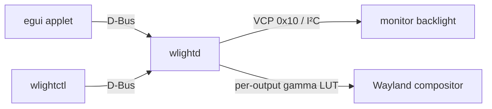

# wlight

`wlight` is a per-monitor brightness controller for Wayland. It adjusts monitor
backlights through DDC/CI and can continue dimming with a per-output gamma LUT
after the hardware brightness reaches a practical lower limit.

## Features

- independent control for each monitor;
- hardware brightness through DDC/CI VCP feature `0x10`;
- software dimming through `wlr-gamma-control-unstable-v1`;
- one unified slider that combines DDC and gamma without a visible jump;
- a typed user-session D-Bus API, CLI, and non-blocking egui applet;
- persistent desired state with hotplug recovery and safe transition ordering;
- EDID-based identities, DisplayPort MST transport deduplication, and DDC retry;
- reproducible Nix package, development shell, NixOS module, and Home Manager
  module.

## Requirements

- Linux with a Wayland session and a user D-Bus session.
- For hardware brightness: DDC/CI enabled in the monitor's on-screen menu, the
  `i2c-dev` kernel module, and read/write access to the relevant `/dev/i2c-*`.
- For software dimming: a compositor that advertises
  `zwlr_gamma_control_manager_v1`.

Gamma control is exclusive. Stop `gammastep`, `wl-gammarelay-rs`, or another
gamma client before using wlight. DDC remains available without compositor
gamma support. A built-in panel can appear as a gamma-only output when the
compositor provides gamma control.

## Quick start from a checkout

Run the daemon in the first terminal:

```console
nix run .#daemon
```

Then open the applet or CLI in a second terminal:

```console
nix run .#applet
nix run .#ctl -- list
```

The initial DDC scan can take several seconds. Direct `nix run` usage starts the
daemon explicitly; after a system installation with the Home Manager module,
the user service starts with the graphical session.

## NixOS and Home Manager installation

Add the flake input:

```nix
inputs.wlight.url = "github:ManiaciaChao/wlight";
```

The NixOS module installs wlight and enables the system-level I²C support:

```nix
{
  outputs = { nixpkgs, wlight, ... }: {
    nixosConfigurations.host = nixpkgs.lib.nixosSystem {
      system = "x86_64-linux";
      modules = [
        wlight.nixosModules.default
        ({ ... }: {
          programs.wlight.enable = true;
          users.users.alice.extraGroups = [ "i2c" ];
        })
      ];
    };
  };
}
```

The Home Manager module installs the clients and starts `wlightd` with the
graphical session. In a `home.nix` that receives your flake inputs through
`extraSpecialArgs`, use:

```nix
{ inputs, ... }: {
  imports = [ inputs.wlight.homeManagerModules.default ];
  services.wlight.enable = true;
}
```

A complete DDC setup normally uses both modules: NixOS configures the kernel
device and group, while Home Manager owns the user service. Log out and back in
after adding the `i2c` group. Membership permits low-level I²C commands; do not
replace the group rule with broad `0666` device permissions.

For local flake development, replace the GitHub input with
`path:/path/to/wlight`.

## Using wlight

The applet's main slider controls effective brightness. Above the hardware
floor it primarily uses DDC; below the floor it keeps the monitor backlight at
that floor and supplies the remaining attenuation with gamma. The **Advanced**
section exposes the raw DDC and gamma controls independently.

Common CLI commands:

```console
wlightctl list [--json]
wlightctl refresh [--json]
wlightctl set <ID> <0..100>
wlightctl set-ddc <ID> <0..100>
wlightctl set-gamma <ID> <0..100>
```

Setting unified or gamma brightness to 0% produces a fully black LUT. Before
testing it, record the display ID and keep a recovery command available:

```console
wlightctl set <ID> 100
```

If the graphical session is unreadable, switch to a virtual terminal and stop
`wlightd`, or use the monitor's physical controls.

## Configuration

The configuration file is `$XDG_CONFIG_HOME/wlight/config.toml`, or
`~/.config/wlight/config.toml` when `XDG_CONFIG_HOME` is unset. The default
hardware floor is 20%:

```toml
hardware_floor = 0.20
```

`wlightd --hardware-floor 15` overrides it with 15% for that daemon invocation
without changing the saved configuration. Stop the daemon before editing the
file manually; display entries are otherwise maintained automatically after a
successful hardware update.

DDC monitor IDs use a digest of the EDID base block. A gamma-only output has an
ID such as `wayland:DP-1`; this is a connector profile, not a physical-monitor
identity. The daemon restores that profile whenever the connector reappears,
even if a different monitor was attached. Before replacing a gamma-only
monitor, stop the daemon and remove that entry if its old gamma value would be
inappropriate for the replacement.

## Troubleshooting

The development shell contains `ddcutil`, `wayland-info`, and `rg`:

```console
nix develop
```

1. Enable DDC/CI in the monitor's on-screen menu. Some docks, KVM switches, and
   cables do not pass DDC traffic.
2. Check the kernel device and permissions:

   ```console
   sudo modprobe i2c-dev
   ls -l /dev/i2c-*
   id
   getfacl /dev/i2c-*
   ddcutil detect
   ```

3. Check compositor gamma support:

   ```console
   wayland-info | grep zwlr_gamma_control_manager_v1
   ```

4. Stop competing gamma programs. If `wlightd` was already running, ask it to
   acquire fresh controls afterward:

   ```console
   systemctl --user stop wl-gammarelay.service
   nix run .#ctl -- refresh
   ```

5. Inspect daemon and D-Bus status:

   ```console
   journalctl --user -u wlight -b
   busctl --user status io.github.wlight
   ```

   For a foreground diagnostic run:

   ```console
   systemctl --user stop wlight.service
   RUST_LOG=wlightd=debug,wlight_backend=debug nix run .#daemon
   ```

## How it works



With the default 20% floor, an 8% target becomes `DDC=20%` and `gamma=40%`.
DDC is an integer percentage, so wlight rounds the hardware factor upward and
uses gamma for the exact fractional remainder. The daemon serializes hardware
mutations, applies dimming steps before brightening steps, and attempts rollback
if a combined update fails.

See [Architecture](docs/architecture.md) for the D-Bus contract, concurrency
model, EDID association, MST alias handling, and failure boundaries.

## Development

```console
nix develop
cargo fmt --all -- --check
cargo clippy --workspace --all-targets -- -D warnings
cargo test --workspace
nix flake check
nix build
```

The workspace contains six crates:

- `wlight-core`: brightness policy, gamma tables, and shared models;
- `wlight-backend`: DDC/CI and Wayland gamma backends;
- `wlight-dbus`: the typed D-Bus contract;
- `wlight-daemon`: the `wlightd` user service;
- `wlightctl`: the command-line client;
- `wlight-applet`: the egui frontend.

The service owns `io.github.wlight` on the session bus, exports
`/io/github/wlight`, and implements `io.github.wlight.Manager1`. Inspect it with:

```console
busctl --user introspect io.github.wlight /io/github/wlight
```

## References

The design draws on the Wayland gamma lifecycle in
[wl-gammarelay-rs](https://github.com/MaxVerevkin/wl-gammarelay-rs) and the
DDC/CI operational experience documented by
[ddcutil](https://github.com/rockowitz/ddcutil). The implementation uses the
Rust `ddc-hi` backend directly; it does not parse `ddcutil` terminal output.

## License

`wlight` is licensed under the
[GNU General Public License v3.0 only](LICENSE).
